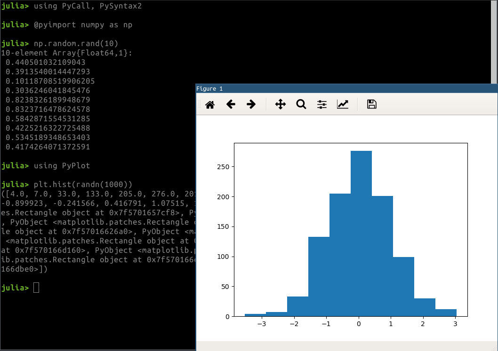

# PySyntax2

[](https://travis-ci.com/goropikari/PySyntax2.jl)
[](https://ci.appveyor.com/project/goropikari/PySyntax2-jl)
[](https://codecov.io/gh/goropikari/PySyntax2.jl)
[](https://coveralls.io/github/goropikari/PySyntax2.jl?branch=master)

This is short life package until finishing "[WIP: override get/setproperty and propertynames](https://github.com/JuliaPy/PyCall.jl/pull/517)".

# Installation
```julia
(v1.0) pkg> add https://github.com/goropikari/PySyntax2
```
or
```julia
using Pkg
Pkg.pkg"add https://github.com/goropikari/PySyntax2"
```

# Usage
```julia
using PyCall, PySyntax2
np = pyimport("numpy") # @pyimport numpy as np
np.random.rand(10)

using PyPlot
plt.hist(randn(1000))
```




# References
- [PySyntax.jl](https://github.com/kdheepak/PySyntax.jl)
- [allow overloading of a.b field access syntax](https://github.com/JuliaLang/julia/issues/1974)
- [WIP: override get/setproperty and propertynames](https://github.com/JuliaPy/PyCall.jl/pull/517)
